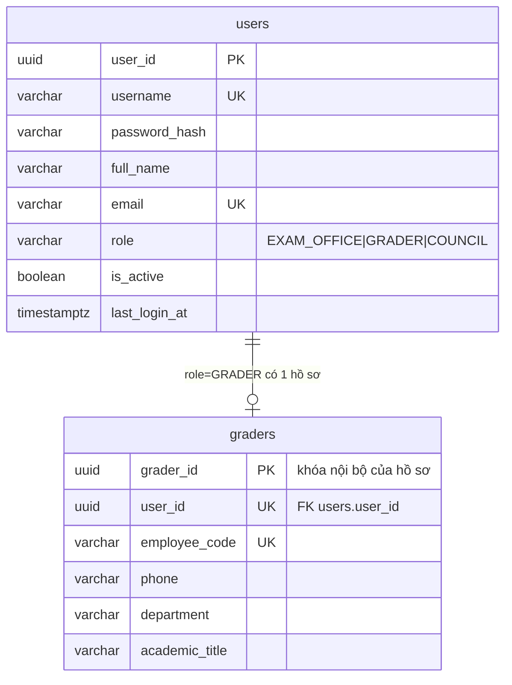

# 13. Người dùng và giám khảo (Identity DB)

> Phiên bản: 1.0 | Ngày: 2026-10-03 | Chủ sở hữu dữ liệu: **Identity/Pseudonym Service**
> Schema gốc do chủ dự án tạo (`sql/identity/V1__users_graders.sql`). Các chỉnh sửa đề xuất nằm ở `sql/identity/V2__users_hardening.sql`.

## 1. Mô hình

- `users`: một dòng cho mỗi tài khoản, **một role duy nhất** (JWT yêu cầu đúng một role; nhiều role → 403).
- `graders`: hồ sơ mở rộng, chỉ dành cho user có `role='GRADER'`. EXAM_OFFICE và COUNCIL không có bảng hồ sơ.

## 2. Quy tắc định danh (quan trọng với các service khác)

| Quy tắc | Nội dung |
|---|---|
| ID dùng chung | **`users.user_id`** là định danh người dùng ở mọi nơi: `sub` trong JWT, `grader_id` trong `GradingAssignment/GradingAttempt`, `decided_by`, `confirmed_by`, `changed_by`, `actor_id` trong `audit_log`, `exam_grader.user_id`. |
| `graders.grader_id` | Chỉ là khóa chính nội bộ của bảng hồ sơ. **Không** đưa ra API công khai, internal API hay DB service khác, để tránh hai loại ID cùng gọi là "grader id". |
| Ranh giới | Chỉ Identity Service có credential vào `users`/`graders`. Service khác lấy tên/trạng thái qua `POST /internal/v1/users/lookup`. |
| Che danh tính giám khảo | COUNCIL chỉ thấy nhãn `GK1..GKn` / `CL1..CLn`. Không trả `userId`, họ tên, mã giáo viên của giám khảo cho COUNCIL (D-16). GRADER không xem được thông tin giám khảo khác. |
| Không xóa cứng | Không có `DELETE user`. Ngừng dùng bằng `is_active=false`, vì user đã xuất hiện trong assignment/attempt/audit. |
| Retention | Tài khoản và hồ sơ **không** bị purge (không phải dữ liệu chi tiết bài thi, FR-025). |

## 3. Nhận xét về schema hiện tại và điều chỉnh đề xuất (`V2`)

| # | Vấn đề | Điều chỉnh |
|---|---|---|
| 1 | `graders.user_id` **chưa có khóa ngoại** tới `users`, và không có gì đảm bảo user đó có `role='GRADER'`. | Thêm cột `graders.role` cố định `'GRADER'` và FK ghép `(user_id, role) → users(user_id, role)`. Không thể gắn hồ sơ giám khảo cho user EXAM_OFFICE/COUNCIL, và không thể đổi role của user đang có hồ sơ. |
| 2 | `UNIQUE(username)`, `UNIQUE(email)` phân biệt hoa/thường: `An` và `an` thành hai tài khoản. | Thêm unique index trên `lower(username)` và `lower(email)`. |
| 3 | Không có chỗ lưu số lần đăng nhập sai nên không khóa tài khoản được (spec dùng `LOGIN_MAX_FAILURES=5`). | Thêm `failed_login_count`, `locked_until`, `must_change_password`. |
| 4 | `updated_at` không tự cập nhật. | Trigger `set_updated_at()` cho cả hai bảng. |
| 5 | `password_hash NOT NULL` | Giữ nguyên. Nếu sau này dùng IdP ngoài, lưu giá trị băm ngẫu nhiên không dùng được. |
| 6 | Thiếu index phục vụ danh sách lọc theo role/trạng thái. | Index `(role, is_active)`. |

Nếu không muốn khóa tài khoản: bỏ mục 3, đặt `LOGIN_MAX_FAILURES=0` (tắt) trong cấu hình.

Hai bảng chưa được chạy thử trong môi trường của tôi (sandbox không có PostgreSQL). Cần chạy migration thử bằng Testcontainers PostgreSQL 16 trước khi dùng.

## 4. API

Tất cả do Identity Service phục vụ (qua Gateway). Lỗi theo `{code,message,requestId}`.

### 4.1 Đăng nhập và tài khoản của chính mình

| Endpoint | Role | Mô tả |
|---|---|---|
| `POST /api/v1/auth/login` (**public**, Gateway bỏ qua kiểm JWT cho path này, có rate-limit) | — | Body `{username,password}`. 200 `{accessToken,tokenType:"Bearer",expiresIn,mustChangePassword}`. Mọi lý do thất bại (sai tên/mật khẩu, `is_active=false`, đang bị khóa) đều trả **cùng một** `401 INVALID_CREDENTIALS` với cùng thông điệp, để không lộ tài khoản có tồn tại hay không. |
| `GET /api/v1/users/me` | mọi role | `{userId,username,fullName,email,role}`; nếu GRADER kèm `graderProfile`. |
| `POST /api/v1/users/me/change-password` | mọi role | `{currentPassword,newPassword}`; xóa `must_change_password`. |

JWT: `sub=user_id`, `role`, `iss`, `iat`, `exp=iat+JWT_TTL_MINUTES` (mặc định 15), `jti`. Ký RS256, Identity công bố JWKS tại `/.well-known/jwks.json` (public). Gateway verify bằng JWKS (không gọi Identity mỗi request).

Đăng nhập: BCrypt cost 12 (hoặc Argon2id) cho `password_hash`; mật khẩu tối thiểu 8 ký tự. Sai `LOGIN_MAX_FAILURES` lần liên tiếp → `locked_until = now + LOGIN_LOCK_MINUTES`; thành công thì đặt `failed_login_count=0`, ghi `last_login_at`.

### 4.2 Quản trị người dùng (EXAM_OFFICE)

| Endpoint | Mô tả |
|---|---|
| `POST /api/v1/users` | `{username,fullName,email?,role,password?,graderProfile?:{employeeCode?,phone?,department?,academicTitle?}}`. Một transaction tạo `users` (+ `graders` nếu `role=GRADER`; `graderProfile` với role khác → 422). Không có `password` → sinh mật khẩu tạm, trả **một lần** trong response, đặt `must_change_password=true`. 409 `USERNAME_TAKEN` / `EMAIL_TAKEN`. |
| `GET /api/v1/users?role=&isActive=&query=&cursor=&limit=` | Danh sách phân trang (D-06). `query` khớp username/họ tên/email/mã giáo viên. Không trả `password_hash`. |
| `GET /api/v1/users/{userId}` | Chi tiết + `graderProfile`. |
| `PATCH /api/v1/users/{userId}` | Cho phép đổi `fullName`, `email`, `isActive`, `graderProfile`. **Không đổi `role`** (409 `ROLE_CHANGE_FORBIDDEN`): cần đổi role thì tạo tài khoản mới. Không cho vô hiệu hóa EXAM_OFFICE đang hoạt động cuối cùng (409 `LAST_EXAM_OFFICE`). |
| `POST /api/v1/users/{userId}/reset-password` | Sinh mật khẩu tạm trả một lần, `must_change_password=true`, xóa khóa. |

GRADER và COUNCIL gọi các endpoint này → 403.

### 4.3 Internal

`POST /internal/v1/users/lookup` (caller allowlist: `exam-grading`, `result-review`): `{userIds:[uuid]}` → `{items:[{userId,username,fullName,role,isActive}]}`. Không trả `password_hash`, `email`, thông tin hồ sơ.

## 5. Quy tắc nghiệp vụ liên quan

1. **Đăng ký giám khảo vào kỳ thi** (`exam_grader`): chỉ nhận `userId` có `role=GRADER` và `is_active=true`, nếu không → 422 `GRADER_NOT_REGISTERED`.
2. **Giao bài (assignment)**: giám khảo phải nằm trong `exam_grader` của kỳ thi và `is_active=true` tại thời điểm giao.
3. **Vô hiệu hóa giám khảo đang có assignment mở**: không tự hủy assignment; `PATCH` trả cảnh báo `openAssignmentCount` do Exam & Grading cung cấp (EO tự quyết định hủy/giao lại).
4. JWT đã cấp vẫn hợp lệ tới khi hết hạn (Q-12). Khi cần cắt ngay, hạ `JWT_TTL_MINUTES`.
5. **Khởi tạo**: nếu chưa có user EXAM_OFFICE nào và có `BOOTSTRAP_ADMIN_USERNAME/PASSWORD`, Identity tạo tài khoản EXAM_OFFICE đầu tiên với `must_change_password=true`. Không có cấu hình này thì service không tự tạo.
6. **Audit** (`audit_log`): tạo/sửa/vô hiệu hóa user, reset mật khẩu, đăng nhập thất bại dẫn tới khóa. Không ghi mật khẩu, hash, token.
7. **Log**: tuyệt đối không log `password`, `password_hash`, `accessToken`.

## 6. Kiểm thử (bổ sung cho file 11, mục K)

Xem `11-acceptance-tests.md` mục K (AT-K01..AT-K14).
