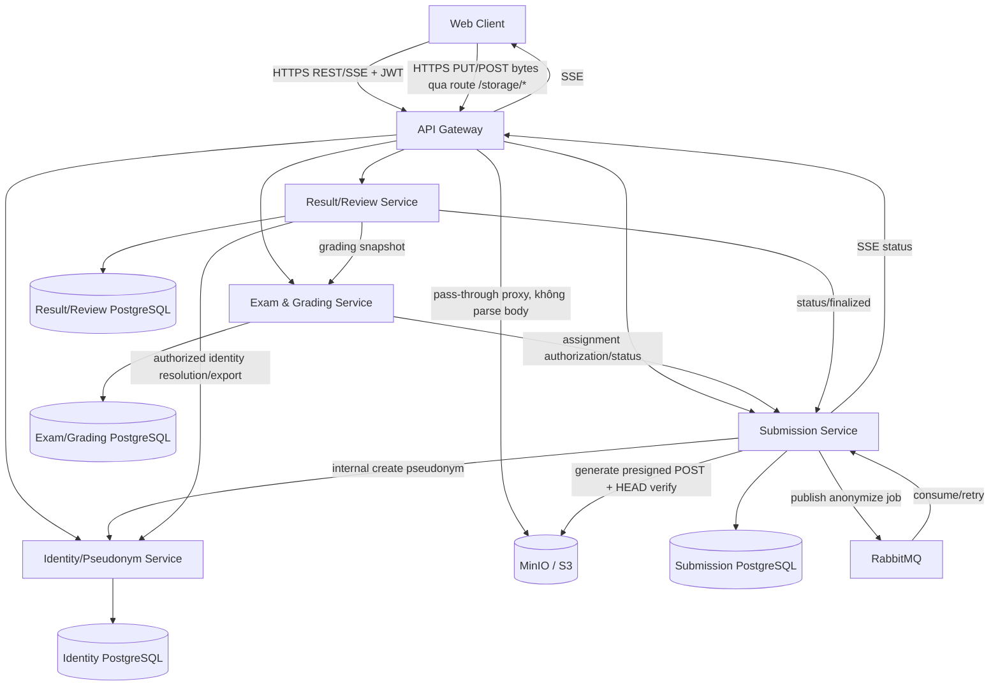

# Hệ thống số hóa và quản lý chấm bài thi tự luận trực tuyến — 02. Architecture
> Phiên bản: 2.0 (hợp nhất v1.0 + v1.1) | Ngày hợp nhất: 2026-09-22 | Trạng thái: final
> Ghi chú hợp nhất: tài liệu này thay thế cả 02-architecture-ver1.0.md và 02-architecture-ver1_1.md. Nội dung lấy nền từ v1.0, tích hợp thay đổi luồng upload sang "presigned POST direct-to-MinIO qua Gateway pass-through" theo ADR-013 (v1.1). Các phần không liên quan tới ADR-013 giữ nguyên như v1.0.

## Phong cách kiến trúc
Chọn microservice rút gọn đúng constraint: API Gateway + 4 bounded services, database-per-service, REST nội bộ và RabbitMQ cho anonymization. Không tách nhỏ thêm vì quy mô đồ án/MVP và Docker Compose; việc tách 4 service hiện tại có giá trị rõ ràng cho cô lập danh tính, xử lý PDF, chấm và kết quả (FR-008, FR-023; NFR-security). Event-driven chỉ áp dụng nơi cần bất đồng bộ thay vì biến toàn hệ thống thành event-driven.

## Sơ đồ thành phần

## Luồng request điển hình: upload và ẩn danh
1. **Khởi tạo upload**: EXAM_OFFICE gọi `POST /api/v1/exams/{examId}/submissions` với metadata thuần JSON `{candidateId, templateId, fileName, fileSizeBytes, contentType}` — không có multipart file trong request này. Gateway xác JWT, forward danh tính bằng internal headers đã ký/HMAC. Submission kiểm resource role, kiểm `fileSizeBytes ≤ 52428800` và `contentType == application/pdf` theo khai báo, sinh `submission_id` và `object_key` xác định trước (server chọn key, client không được tự đặt), tạo bản ghi `status=UPLOADING` (ý nghĩa: "đã cấp quyền upload, chờ client đẩy bytes"), rồi gọi MinIO SDK (nội bộ, có credential) để sinh **presigned POST policy** (chữ ký, điều kiện `content-length-range`, `key` cố định, TTL ngắn — mặc định 10 phút). Response 201 trả `{submissionId, status:"UPLOADING", upload:{url, fields}, uploadExpiresAt, statusUrl}` (FR-006, FR-023).
2. **Upload bytes trực tiếp**: Web Client POST multipart-form (theo `fields` được cấp) thẳng tới `url` — một path pass-through trên Gateway (`/storage/original/{objectKey}`), Gateway chỉ forward nguyên trạng request tới MinIO (`proxy_request_buffering off`), không parse, không buffer, không đi qua Submission Service. MinIO tự verify chữ ký/điều kiện policy (bao gồm `content-length-range`) trước khi chấp nhận ghi object; sai chữ ký/hết hạn/vượt size → MinIO trả lỗi trực tiếp cho client, Submission Service không cần biết.
3. **Xác nhận hoàn tất**: Web Client gọi `POST /api/v1/submissions/{id}/complete`. Submission Service HEAD object trong MinIO để xác minh tồn tại và `size_bytes` thực tế khớp khai báo trong dung sai cho phép; nếu hợp lệ, ghi `ExamFile{type:ORIGINAL, object_key, size_bytes}` (chưa có `sha256` ở bước này — xem bước 4), chuyển `status=UPLOADED` rồi `VALIDATING`. Nếu object không tồn tại hoặc hết hạn → 409 `UPLOAD_NOT_FOUND`/`UPLOAD_EXPIRED`. Nếu size mismatch vượt giới hạn → xóa object, `status=FAILED`, `failure_code=FILE_TOO_LARGE`.
4. Worker VALIDATING tải object về (vốn đã cần làm để đọc PDF), xác thực PDF ≤50 MB, 1–20 trang, đọc được, kích thước ±5% template, **đồng thời tính SHA-256 và ghi vào `ExamFile.sha256`** (dời từ lúc nhận file sang bước này vì backend không còn trực tiếp nhận bytes lúc upload) (FR-007). File hỏng → FAILED; mismatch nghiệp vụ → REVIEW_REQUIRED theo BR-016.
5. Khi hợp lệ, Submission gọi Identity API để sinh pseudonym CSPRNG với unique(exam_id,value); Identity giữ candidate↔submission↔pseudonym duy nhất trong Identity DB (FR-008, BR-005/006).
6. Submission publish job có submissionId/templateId/pseudonym; worker consume, chuyển ANONYMIZING, lấy ORIGINAL bằng service credential, tạo bản sao, phủ vùng cố định trang 1 và ghi phách; ORIGINAL không bị sửa (BR-013/014).
7. ANONYMIZED được lưu bucket/prefix riêng; thành công → READY_FOR_GRADING. Lỗi kỹ thuật retry exponential backoff tối đa 3 lần; hết retry → FAILED. Lỗi template/PDF vẫn đọc được → REVIEW_REQUIRED (FR-010/011/022).
8. Mọi transition ghi DB trước rồi phát SSE; reconnect dùng snapshot REST (FR-009).

### Dọn dẹp upload dang dở
Vì backend không còn biết ngay lập tức khi client bỏ dở việc upload (không gọi `/complete`, hoặc gọi thất bại), cần hai cơ chế bổ sung:
- Submission ở `UPLOADING` quá `uploadExpiresAt` mà chưa `complete` → job định kỳ chuyển `status=FAILED`, `failure_code=UPLOAD_ABANDONED`.
- Job định kỳ quét bucket `original` tìm object không có `ExamFile` tương ứng sau một khoảng an toàn (vd 1 giờ) → xóa object orphan. Việc này idempotent và không phụ thuộc DB transaction xuyên service (xem 09-risks).

## Luồng chấm và xác định điểm
1. EXAM_OFFICE gọi bulk assignment; Exam & Grading chỉ nhận submission đủ điều kiện; SINGLE_REVIEW chỉ hợp lệ với REVIEW_REQUIRED (FR-012, BR-019).
2. GRADER lấy assignment qua Gateway. Exam & Grading kiểm tra assignment của user trước khi trả grading context; URL PDF ẩn danh là URL ngắn hạn do Submission cấp sau authorization. Không có API ORIGINAL cho GRADER (FR-013, FR-023).
3. Điểm câu lưu dạng draft và khi confirm kiểm tra 0≤score≤max và đủ câu bắt buộc; lượt chấm chuyển COMPLETED. Trước confirm không trả dữ liệu grader khác (FR-014/015).
4. Result/Review nhận snapshot các lượt đã confirm. Không cross-grade: dùng lượt duy nhất. Có cross-grade: so sánh mọi cặp tổng điểm; tất cả ≤ threshold thì mean và HALF_UP 2 số, nếu không tạo review (FR-016, BR-010/017).
5. Hội đồng giải quyết bất đồng chuyên môn bằng decision có reason; EXAM_OFFICE xử lý lỗi kỹ thuật/quy trình. Khi không review mở và đủ điều kiện, EXAM_OFFICE yêu cầu finalize; Result lưu kết quả cốt lõi rồi Submission ghi FINALIZED/finalized_at (FR-017/018/020).

## Luồng phúc khảo
Yêu cầu phúc khảo tạo Review, Submission vào REVIEW_REQUIRED. EXAM_OFFICE tạo SINGLE_REVIEW assignment; lượt mới mang attemptNo tăng và không được đọc lượt cũ trước confirm. Điểm cuối mới chỉ được xác nhận theo thẩm quyền review; lịch sử cũ giữ tới retention (FR-024).

## Luồng retention
Result/Review chạy scheduler định kỳ (mặc định mỗi ngày) chọn final result có retention_deadline ≤ now và chưa purge. Nó orchestration các lệnh idempotent: Exam & Grading xóa score detail/grading attempts/assignment chi tiết thuộc submission; Submission xóa object ORIGINAL/ANONYMIZED và metadata chi tiết; Identity xóa pseudonym/mapping/history; Result xóa review chi tiết nhưng giữ FinalResult snapshot gồm thông tin thí sinh, kỳ thi/môn và final score. Mỗi service trả purge receipt; chỉ khi đủ receipt mới đánh dấu PURGED (FR-025, BR-022). Candidate master và exam context cốt lõi không bị policy này xóa.

## Nhất quán và lỗi phân tán
Không dùng distributed transaction. Các thao tác liên-service có idempotency key (submissionId + operation) và trạng thái durable. Anonymization queue dùng manual ack; worker chỉ ack sau commit kết quả. Duplicate delivery an toàn vì kiểm tra processing step/object key. Finalization thực hiện theo saga orchestration tại Result/Review: validate conditions → persist immutable FinalResult snapshot → yêu cầu Submission FINALIZED; retry được nếu call sau thất bại. Retention cũng idempotent. Upload direct-to-storage cũng theo nguyên tắc idempotent: `complete` gọi lại nhiều lần với cùng object key an toàn (idempotency theo submissionId), và job dọn orphan không phụ thuộc trạng thái tức thời của client. Cách này đáp ứng availability mà không đưa Kafka/Kubernetes vào MVP.

## Trust boundaries
Chỉ Gateway expose ra host; business services, DB, RabbitMQ và MinIO ở internal Docker network. Route `/storage/*` là một route pass-through bổ sung trên Gateway (không phải cổng mới, không phải service mới): Gateway forward nguyên trạng method/headers/query string tới MinIO nội bộ, không xử lý logic nghiệp vụ, không parse body, không cần biết nội dung file. MinIO **không** có domain/port public riêng (loại trừ rõ Option B — MinIO expose trực tiếp — xem ADR-013). Vì upload đi qua cùng origin với Gateway, không cần cấu hình CORS cho MinIO. Shared secret thuần túy được nâng thành chữ ký HMAC trên `X-User-Id`, `X-Role`, timestamp/request-id để chống giả mạo/replay trong mạng nội bộ; service từ chối header thiếu/sai và vẫn làm resource authorization. Object Storage bucket ORIGINAL không cấp presigned URL cho GRADER; presigned POST cho upload ORIGINAL chỉ được cấp cho EXAM_OFFICE sau khi resource-authorization ở Submission Service, và chỉ hợp lệ cho đúng `object_key`/kích thước/khoảng thời gian đã ký. Các quyết định này đáp ứng FR-023 và NFR-security.
