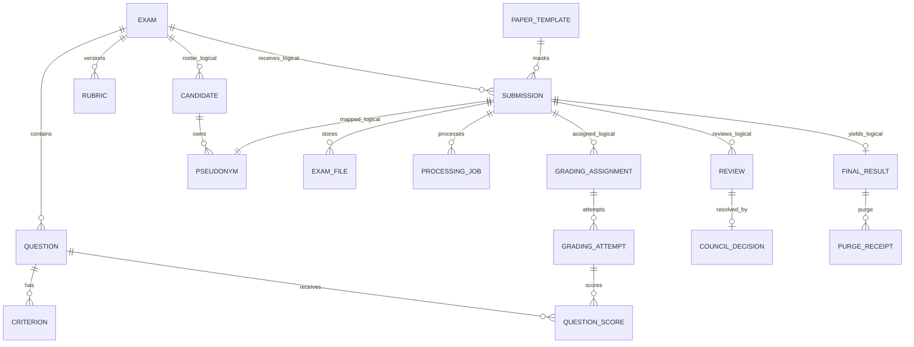

# Hệ thống số hóa và quản lý chấm bài thi tự luận trực tuyến — 04. Data Model
> Phiên bản: 2.0 (hợp nhất v1.0 + v1.1) | Ngày hợp nhất: 2026-09-22 | Trạng thái: final
> Ghi chú hợp nhất: tài liệu này thay thế cả 04-data-model-ver1.0.md và 04-data-model-ver1_1.md. `Submission` bổ sung `upload_expires_at` và tách `declared_file_size_bytes`/`file_size_bytes`; `ExamFile.sha256` chuyển từ bắt buộc sang tùy chọn cho tới khi VALIDATING hoàn tất (ADR-013). Các entity khác giữ nguyên nội dung v1.0.

## Quy ước
PK dùng UUID; thời gian `timestamptz`; điểm dùng `numeric(7,2)` (tính trung gian giữ precision cao hơn trước HALF_UP); JSON rubric/grid dùng `jsonb`. FK chỉ tồn tại trong cùng service DB; quan hệ xuyên service là logical reference UUID và xác minh qua API, phù hợp BR-006. Các cột audit phổ biến `created_at`, `updated_at` là NOT NULL trừ khi nêu khác.

## Identity DB

### Candidate (Thí sinh)
`candidate_id uuid PK` bắt buộc; `exam_id uuid` bắt buộc logical reference; `candidate_number varchar(50)` bắt buộc; `full_name varchar(255)` bắt buộc; `class_name varchar(100)` tùy chọn. UNIQUE(exam_id,candidate_number) đáp ứng FR-005/BR-020. Candidate được giữ lâu dài theo FR-025.

### Pseudonym (Số phách)
`pseudonym_id uuid PK`; `exam_id uuid` bắt buộc; `submission_id uuid` bắt buộc; `candidate_id uuid FK Candidate` bắt buộc; `value varchar(64)` bắt buộc; `active boolean` bắt buộc; `created_at timestamptz` bắt buộc. UNIQUE(exam_id,value), UNIQUE(submission_id) với bản hiện hành; sinh bằng CSPRNG (FR-008, BR-005). Bản ghi và lịch sử chỉnh sửa bị purge sau retention.

### PseudonymHistory
`history_id uuid PK`; `pseudonym_id uuid`; `old_value varchar(64)` tùy chọn; `new_value varchar(64)` bắt buộc; `changed_by varchar(100)` bắt buộc; `reason text` bắt buộc; `changed_at timestamptz` bắt buộc. Thuộc retention một năm (assumption đã chốt trong requirements).

## Submission DB

### PaperTemplate (Mẫu giấy thi)
`template_id uuid PK`; `name varchar(150)` bắt buộc; `page_width numeric` và `page_height numeric` bắt buộc; `mask_x`, `mask_y`, `mask_width`, `mask_height numeric(8,6)` bắt buộc, CHECK trong [0,1] và vùng không vượt trang; `pseudonym_print_region jsonb` bắt buộc; `active boolean` bắt buộc. Đây là mô hình logic cho vùng cố định theo FR-008/BR-014.

### Submission
`submission_id uuid PK`; `exam_id uuid` bắt buộc; `template_id uuid FK PaperTemplate` bắt buộc; `status enum` bắt buộc gồm UPLOADING/UPLOADED/VALIDATING/ANONYMIZING/READY_FOR_GRADING/GRADING/REVIEW_REQUIRED/COMPLETED/FINALIZED/FAILED; `page_count smallint` tùy chọn lúc upload, CHECK 1..20 khi validated; `declared_file_size_bytes bigint` bắt buộc CHECK ≤ 52428800 (giá trị client khai báo lúc khởi tạo upload, dùng để tạo policy presigned); `file_size_bytes bigint` tùy chọn, được ghi sau khi `complete` xác minh HEAD object khớp thực tế; `upload_expires_at timestamptz` bắt buộc khi `status=UPLOADING` — dùng cho job dọn dẹp upload dang dở; `metadata jsonb` tùy chọn; `failure_code varchar(80)` tùy chọn (gồm cả giá trị `UPLOAD_ABANDONED`, `UPLOAD_NOT_FOUND`, `UPLOAD_EXPIRED`, `FILE_TOO_LARGE` — FR-006/007); `progress smallint` CHECK 0..100; `finalized_at timestamptz` tùy chọn; `retention_deadline timestamptz` tùy chọn. Ý nghĩa trạng thái `UPLOADING`: "đã cấp presigned policy, chờ client tự đẩy bytes" (không phải "đang nhận multipart qua backend"). Không lưu candidateId/pseudonym value để giữ ranh giới danh tính; correlation do Identity sở hữu (FR-022, FR-025).

### ExamFile (Tệp bài thi)
`file_id uuid PK`; `submission_id uuid FK Submission`; `type enum ORIGINAL|ANONYMIZED`; `object_key varchar(512)` bắt buộc; `sha256 char(64)` tùy chọn lúc tạo — được backend tính và ghi trong bước VALIDATING khi worker tải object về để kiểm PDF (không thực hiện được ngay lúc nhận file vì backend không trực tiếp nhận bytes lúc upload); `size_bytes bigint` bắt buộc, ghi tại bước `complete` từ kết quả HEAD object; `created_at timestamptz`. UNIQUE(submission_id,type). Object và row bị xóa khi retention hết (FR-025); checksum (khi đã có) giúp chứng minh ORIGINAL không bị sửa (BR-013). Trong khoảng thời gian giữa `complete` và khi VALIDATING hoàn tất, `sha256 IS NULL` là trạng thái hợp lệ tạm thời — không được coi là lỗi dữ liệu.

### ProcessingJob
`job_id uuid PK`; `submission_id uuid FK`; `step enum VALIDATE|ANONYMIZE`; `status enum QUEUED|RUNNING|SUCCEEDED|RETRY_WAIT|FAILED`; `attempt int`; `error_code varchar(80)` tùy chọn; `error_detail text` tùy chọn; `next_retry_at timestamptz` tùy chọn. Hỗ trợ FR-010.

## Exam & Grading DB

### Exam (Kỳ thi)
`exam_id uuid PK`; `name varchar(255)`; `subject varchar(255)`; `exam_time timestamptz`; `grade_level varchar(50)` tùy chọn; `scale numeric(7,2)`; `cross_grading_enabled boolean`; `grader_count smallint` CHECK ≥1; `difference_threshold numeric(7,2)` CHECK ≥0; `template_id uuid` logical ref bắt buộc; `status enum DRAFT|ACTIVE|CLOSED`. Thông tin kỳ thi/môn cốt lõi được giữ lâu dài (FR-001, FR-025).

### Question (Câu hỏi)
`question_id uuid PK`; `exam_id uuid FK Exam`; `order_no smallint`; `content text`; `max_score numeric(7,2)` CHECK >0; `required boolean`. UNIQUE(exam_id,order_no). Tổng max_score phải bằng Exam.scale khi activate (FR-002, BR-001).

### Criterion
`criterion_id uuid PK`; `question_id uuid FK Question`; `label varchar(255)`; `description text`; `max_score numeric(7,2)` CHECK >0; `order_no smallint`. Nếu dùng criteria, tổng criterion.max_score phải bằng question.max_score.

### Rubric
`rubric_id uuid PK`; `exam_id uuid FK`; `version int`; `status enum DRAFT|ACTIVE`; `source enum MANUAL|DOCX`; `content_json jsonb`; `confirmed_by varchar(100)` tùy chọn; `confirmed_at timestamptz` tùy chọn. UNIQUE(exam_id,version); chỉ một ACTIVE/exam bằng partial unique index. `content_json` lưu bảng thô rows/cells/text/rowspan/colspan (FR-003/004, BR-002/003).

### GradingAssignment (Phân công chấm)
`assignment_id uuid PK`; `submission_id uuid` logical ref; `exam_id uuid FK`; `grader_id varchar(100)`; `assignment_type enum BULK|SINGLE_REVIEW`; `assigned_at timestamptz`; `status enum ASSIGNED|IN_PROGRESS|COMPLETED|CANCELLED`. UNIQUE(submission_id,grader_id,assignment_id); SINGLE_REVIEW phải được service xác thực trạng thái review (FR-012).

### GradingAttempt (Lượt chấm)
`attempt_id uuid PK`; `assignment_id uuid FK`; `submission_id uuid`; `grader_id varchar(100)`; `attempt_no int`; `is_regrade boolean`; `status enum DRAFT|CONFIRMED`; `total_score numeric(7,2)` nullable trước confirm; `confirmed_at timestamptz` nullable. Lượt chấm lại mới không overwrite lượt cũ (FR-014/015/024).

### QuestionScore (Điểm câu)
`question_score_id uuid PK`; `attempt_id uuid FK`; `question_id uuid FK`; `score numeric(7,2)` CHECK ≥0; `note text` nullable; `needs_review boolean` default false. UNIQUE(attempt_id,question_id). Max-score được validate application transaction dựa Question (FR-014, BR-008). Nếu chấm criterion, bổ sung `criterion_scores jsonb` trong draft/confirmed snapshot; tổng vẫn phải bằng score câu và tuân max criterion.

## Result/Review DB

### Review
`review_id uuid PK`; `submission_id uuid`; `exam_id uuid`; `reason_type enum ANONYMIZATION|SCORE_DIFFERENCE|GRADER_FLAG|REMARK`; `reason text`; `status enum OPEN|RESOLVED`; `opened_at timestamptz`; `resolved_at timestamptz` nullable; `resolution_type enum CONTINUE|REGRADE|COUNCIL_DECISION` nullable. Chi tiết review bị purge khi retention hết (FR-017/024/025).

### CouncilDecision
`decision_id uuid PK`; `review_id uuid FK`; `final_score numeric(7,2)`; `decision_source enum COUNCIL`; `reason text` NOT NULL; `decided_by varchar(100)`; `decided_at timestamptz`. Đáp ứng FR-018/BR-011.

### FinalResult (Kết quả cuối cùng)
`result_id uuid PK`; `submission_id uuid` logical source, nullable sau purge; `exam_id uuid` bắt buộc; `candidate_id uuid` bắt buộc; `candidate_number varchar(50)`; `candidate_name varchar(255)`; `exam_name varchar(255)`; `subject varchar(255)`; `final_score numeric(7,2)`; `decision_source enum SINGLE_GRADER|CROSS_GRADING|COUNCIL|REMARK`; `finalized_at timestamptz`; `retention_deadline timestamptz`; `purge_status enum PENDING|IN_PROGRESS|PURGED|FAILED`. Đây là snapshot kết quả lâu dài; không lưu số phách hay điểm từng câu sau purge (FR-020/025, BR-022).

### PurgeReceipt
`receipt_id uuid PK`; `result_id uuid FK`; `service enum IDENTITY|SUBMISSION|EXAM_GRADING|RESULT_REVIEW`; `status enum PENDING|DONE|FAILED`; `completed_at timestamptz` nullable; `error text` nullable. UNIQUE(result_id,service), phục vụ purge idempotent.

## ERD logic

## Retention và index
Index chính: Submission(status,exam_id), Submission(status,upload_expires_at) (hỗ trợ job dọn upload dang dở), ProcessingJob(status,next_retry_at), Assignment(grader_id,status), Attempt(submission_id,status), Review(submission_id,status), FinalResult(retention_deadline,purge_status). Purge xóa child/detail trong từng DB transaction trước parent tương ứng; FinalResult và Candidate/Exam core không thuộc purge. `retention_deadline` được vật hóa lúc FINALIZED để scheduler không phụ thuộc timezone/calculation lại (FR-025).
